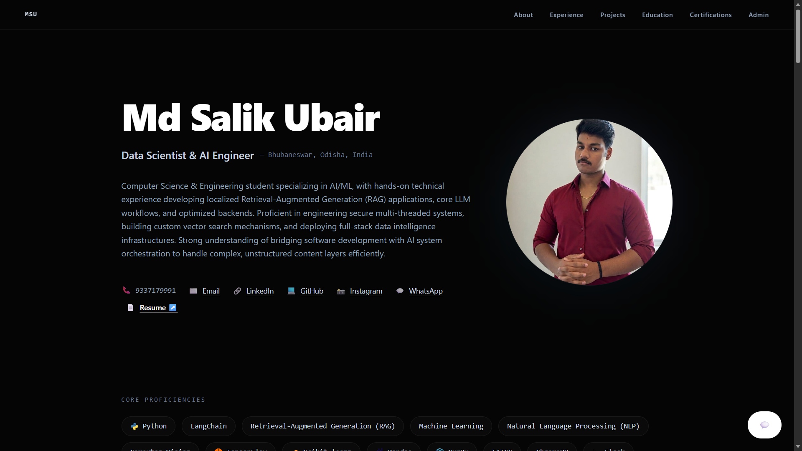
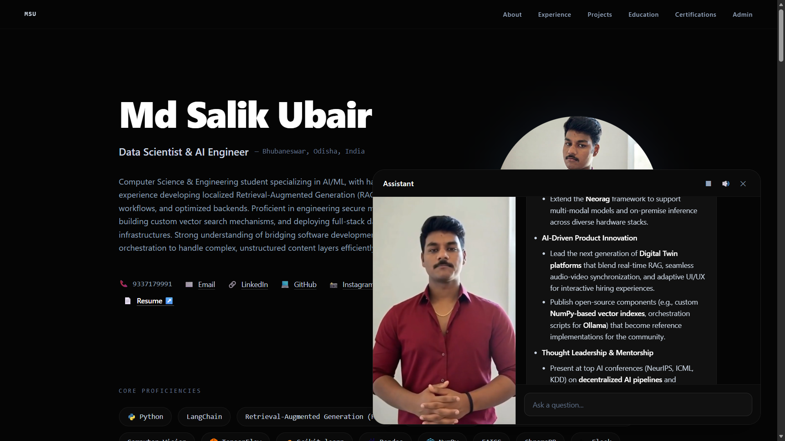
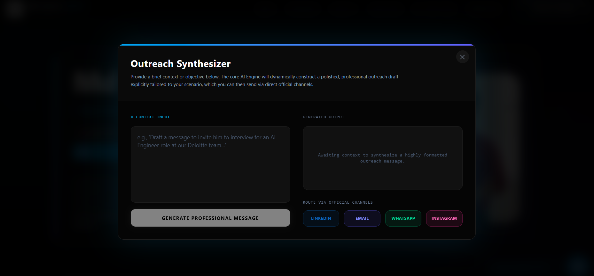
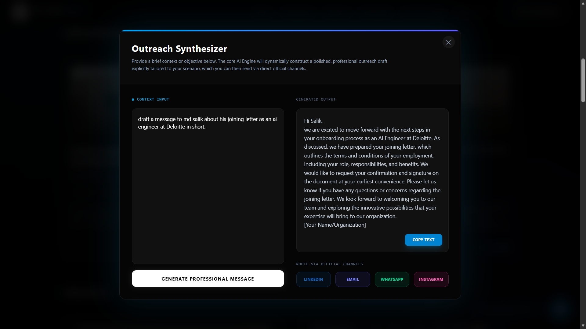
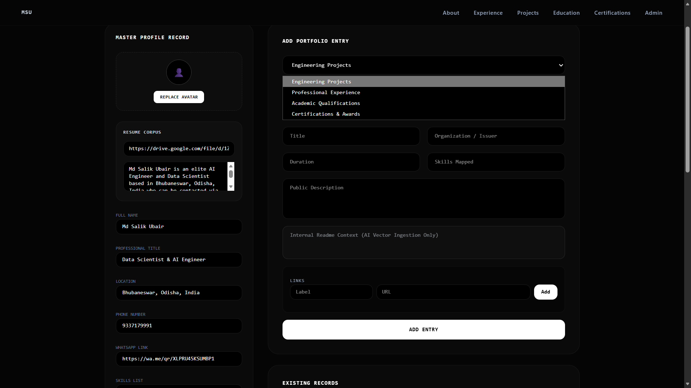
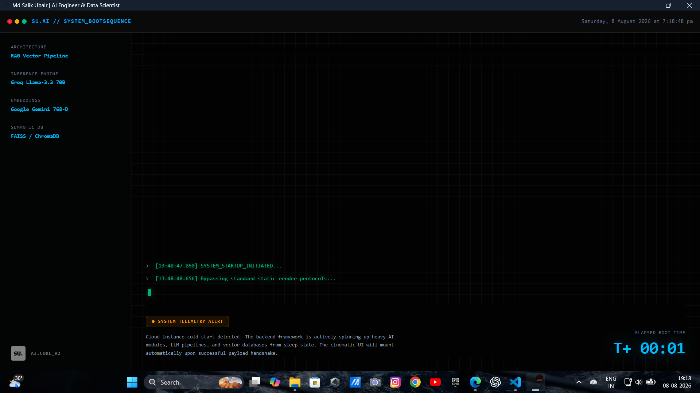
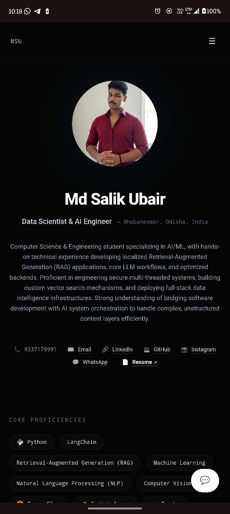

<div align="center">
  
</div>

<h1 align="center">Production-Grade RAG Portfolio & Digital Twin</h1>

<p align="center">
  <b>Architected by Md Salik Ubair</b><br/>
  A next-generation, ultra-scalable web portfolio featuring a <b>localized Retrieval-Augmented Generation (RAG) Digital Twin</b>, an <b>AI Outreach Synthesizer</b>, and a <b>Dynamic Admin Control Hub</b>. Engineered to decouple heavy asynchronous AI orchestration from the client interface, providing seamless, real-time interactive intelligence backed by an editable database matrix.
</p>

<div align="center">
  
  
  
  
  
</div>

---

## 🚀 Architectural Innovations & Core Features

### 1. The Digital Twin (Real-Time RAG Agent)
<div align="center">
  
</div>

*   **Inference Engine:** Utilizes `Llama-3.3 (70B)` via Groq API for ultra-low latency, intelligent response synthesis.
*   **Semantic Matrix:** Localized `ChromaDB` vector store powered by Google Generative AI Embeddings (`text-embedding-004`) with `RecursiveCharacterTextSplitter` for crash-proof data ingestion.
*   **Hidden Context Embedding:** Deep technical documentation (`hidden_readme`) is embedded per database node. The AI autonomously understands complex underlying architectures without cluttering the public UI.
*   **Synchronized Audio-Visuals:** Integrates `Edge-TTS` for real-time audio streaming. Features a hardware-accelerated video state controller mapping an avatar between idle, thinking, and speaking modes.
*   **Zero-Hallucination Guardrails:** Hardcoded ground-truth metrics (dynamic age, verified project counts) injected directly into the LLM context at runtime.

### 2. AI Outreach Synthesizer (One-Shot Copywriting)
<div align="center">
  
  
</div>

*   **Contextual Overrides:** A specialized modal that bypasses standard RAG protocols via Prompt Injection, transforming the core engine into an expert corporate copywriter.
*   **Privacy-First Generation:** Drafts highly professional, tailored outreach emails (e.g., job interviews, freelance collaborations) instantly based on pure intent without logging user data.
*   **Direct Routing:** Seamlessly routes generated intent to native applications (Direct Gmail Web Compose, LinkedIn, WhatsApp, Instagram).

### 3. Dynamic Admin Control Hub & Matrix Synchronization
<div align="center">
  
</div>

*   **Zero-Downtime Reconstructions:** Secure `MongoDB` integration enabling native CRUD manipulation. Saving data instantly triggers background threading to re-index the RAG Vector DB.
*   **O(1) Node Reordering:** Smooth, optimistic UI node sequencing (`↑` / `↓` indices) dynamically synced to the MongoDB pipeline.
*   **Master Resume Pipeline:** Direct ingestion of raw master CV text to instantly update the AI's internal memory matrix.

### 4. Adaptive Cinematic UI & Boot Sequence
<div align="center">
  
  
</div>

*   **Matrix Bootloader:** Simulated cyber-terminal pre-fetching sequence masking standard server cold-start latencies.
*   **Responsive Engine:** Fluid grid-layouts on PC that seamlessly adapt into horizontal snap-scrolling cards on mobile devices for flawless UX.
*   **Custom Cyber Toasts:** Globally deployed sleek, matrix-styled toast notifications replacing standard browser alerts.

---

## ⚙️ System Architecture Data Flow

```text
[ Visitor / Recruiter ]
        │
        ├───► [ React 18 + Tailwind Frontend UI ]
        │            │
        │            ├───► [ Initiate Outreach ] ───► [ LLM Synthesizer Override ] ───► [ Native Routing ]
        │            │
        │            └───► [ Digital Twin Query ]
        │                         │
        └─────────────────────────┼─────────────────────────────────────────────┐
                                  ▼                                             │
                     [ Flask REST Backend API ]                                 │
                                  │                                             │
            ┌─────────────────────┴─────────────────────┐                       │
            ▼                                           ▼                       │
  [ MongoDB Cloud State ]                   [ LangChain RAG Engine ]            │
 (Master Schema / Nodes)                                │                       │
            │                                           ├───► Google Gemini Embeddings (768-D)
            │                                           ├───► ChromaDB Vector Store
            └──────► [ Background Vector Sync ] ────────┼───► Truth Metric Injection
                                                        │
                                                        ▼
                                             [ Groq Llama-3.3-70B ]
                                                        │
                                                        ▼
                                             [ Edge-TTS Audio Sync ]
                                                        │
                                                        ▼
                                          [ Streamed Response to Frontend ]
```
# 🛠️ Core Technology Stack

## Frontend Interface Layer
- **React.js 18 (Vite)**
- **Tailwind CSS v4** (Grainy Gradients, Cyber-Aesthetics)
- **React-Markdown** (Dynamic Text Rendering)
- **Hardware-Accelerated Video Elements**

## Backend Execution Core
- **Python** (Flask, Gunicorn WSGI Gateway)
- **ChromaDB** (Vector Similarity Search)
- **MongoDB** (Persistent Storage & Structural Data)
- **LangChain** (Pipeline Orchestration)
- **Groq API** (Llama-3.3-70b-versatile)
- **Google Generative AI** (text-embedding-004)

---

# 💻 Local Deployment Architecture

## Prerequisites
- Node.js (v16+)
- Python 3.9+
- MongoDB Instance (Local or Cloud Atlas)

---

## 1. Backend Initialization

```bash
cd backend
python -m venv venv
source venv/bin/activate  # On Windows: venv\Scripts\activate
pip install -r requirements.txt

```
# Create a .env file in the backend/ 
### root:
```bash
MONGO_URI=your_mongodb_connection_string
GEMINI_API_KEY=your_google_gemini_api_key
GROQ_API_KEY=your_groq_api_key
```
##### Run the server:
python run.py
# 2. Frontend Initialization
cd frontend
npm install
### Create a .env file in the frontend/ root:
VITE_API_URL=http://127.0.0.1:5000
### Start the development server:
npm run dev
---
<div align="center">
  <p>Architected and Engineered by <b>Md Salik Ubair</b></p>
  <p>AI Engineer I & Data Scientist | 📍 Bhubaneswar, India</p>
  <p>
    <a href="mailto:mdsalikubair@gmail.com">Email</a> • 
    <a href="https://linkedin.com/in/md-salik-ubair">LinkedIn</a> • 
    <a href="https://portfolio-salik-live.vercel.app">Live Portfolio</a>
  </p>
</div>
